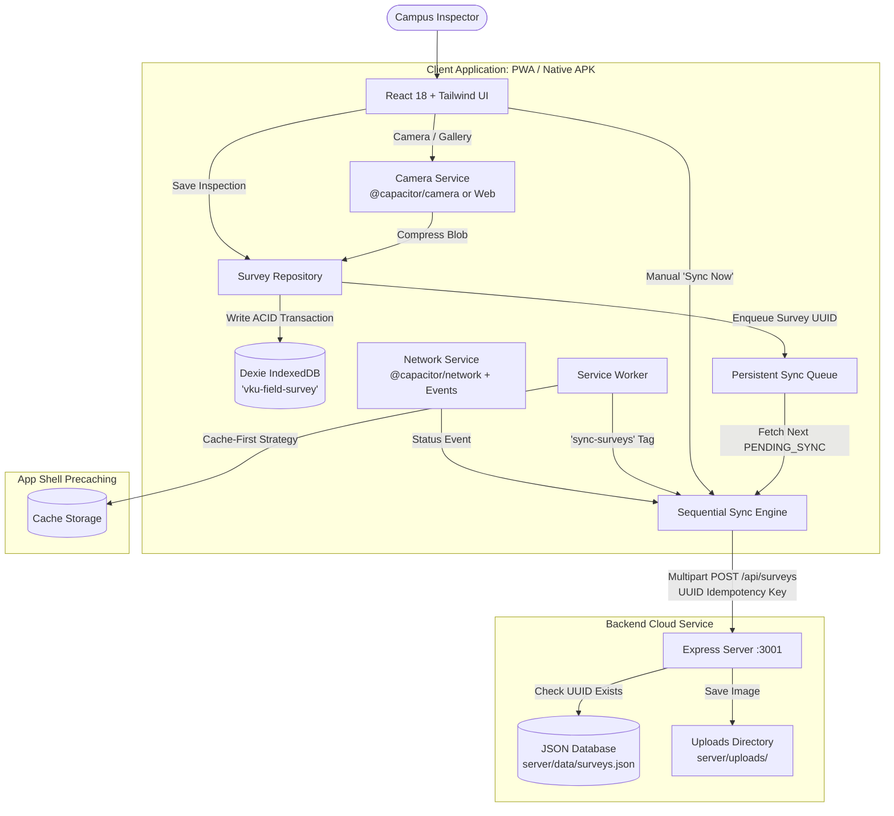

# VKU Field Survey — Offline Data Collection (PWA & Capacitor)

[](https://web.dev/progressive-web-apps/)
[](https://dexie.org/)
[](https://capacitorjs.com/)
[](LICENSE)

An offline-first field inspection mobile and web application built for the **Vietnam-Korea University of Information and Communication Technology (VKU)** campus. Designed specifically for facilities inspectors working in network-denied locations such as basements, electrical vaults, and remote laboratories.

### 🌐 Live Production Deployments (Cloudflare HTTPS)
- **Client 1 — Field Inspector Mobile PWA:** [https://camle-vku-field-survey.lecam.workers.dev/](https://camle-vku-field-survey.lecam.workers.dev/)
- **Client 2 — Facility Command Center Admin Portal:** [https://camle-vku-field-survey-admin.pages.dev/](https://camle-vku-field-survey-admin.pages.dev/)
- **Lead Engineer / Author:** **Lê Cảm** (100% Solo Contribution)

---

## Table of Contents
1. [Project Description](#project-description)
2. [Key Features](#key-features)
3. [Architecture Overview](#architecture-overview)
4. [Technology Stack](#technology-stack)
5. [Project Structure](#project-structure)
6. [Prerequisites & Installation](#prerequisites--installation)
7. [Running Locally (Development)](#running-locally-development)
8. [PWA Offline Testing](#pwa-offline-testing)
9. [Sequential Synchronization & Background Sync](#sequential-synchronization--background-sync)
10. [Dexie IndexedDB Implementation](#dexie-indexeddb-implementation)
11. [Capacitor Android Setup & APK Build](#capacitor-android-setup--apk-build)
12. [Backend REST API](#backend-rest-api)
13. [Troubleshooting](#troubleshooting)
14. [Lab Demonstration Scenario](#lab-demonstration-scenario)

---

## 1. Project Description
Facilities inspectors at VKU routinely encounter areas with zero Wi-Fi or cellular connectivity (4G/5G). Traditional web applications fail in these environments, causing lost data, frustrated inspectors, and unrecorded campus defects.

**VKU Field Survey** solves this by adopting a strict **Offline-First Architecture**:
- **IndexedDB is the primary source of truth** for all surveys created on the device.
- All inspection records are tagged with a client-generated **UUIDv4**, **timestamps**, and synchronization status.
- Defect photos are compressed client-side and saved locally as binary **Blobs**.
- The app shell is cached via a **Cache-First Service Worker**, allowing cold launches without any network.
- When internet connectivity returns, surveys upload **sequentially** to prevent network congestion, backed by **Background Sync**, **network listeners**, and **manual sync** fallbacks.

---

## 2. Key Features

- **100% Offline App Boot**: Service Worker caches HTML, CSS, JavaScript, fonts, and icons.
- **Client-Side Data Persistence**: Dexie IndexedDB manages `surveys` and `syncQueue` tables.
- **Sequential Synchronization**: Uploads surveys one-by-one to prevent network saturation.
- **UUID Idempotency**: Guarantees zero duplicate server records if an upload is retried.
- **Photo Capture & Compression**: Native Android camera via `@capacitor/camera` with HTML5 camera fallback for web; automatic Canvas compression (max 1280px, ~200KB).
- **Multi-Level Connectivity Detection**: Integrates `@capacitor/network` with browser `online`/`offline` listeners.
- **Dynamic Status Badging**: Displays `ONLINE`, `OFFLINE`, `SYNCING`, `SYNCED`, and `FAILED` status across the app.
- **Cross-Platform Delivery**: Runs as a desktop/mobile PWA and builds as a native Android APK via Capacitor.

---

## 3. Architecture Overview



---

## 4. Technology Stack

### Frontend & PWA
- **React 18** + **TypeScript** + **Vite 6**
- **Tailwind CSS** (VKU Theme `#0284c7`)
- **Dexie.js 4** & **dexie-react-hooks** (IndexedDB ODM)
- **vite-plugin-pwa** & **Workbox** (Service Worker, Cache-First, precaching)
- **Lucide React** (Icons)

### Mobile & Native
- **Capacitor 7 Core & CLI**
- **@capacitor/android** (Android platform bridge)
- **@capacitor/camera** (Native camera & photo picker)
- **@capacitor/network** (Native connectivity detection)

### Backend API
- **Node.js** & **Express**
- **Multer** (Multipart/form-data upload handling)
- **CORS** & file persistence (zero-config database for instant evaluation)

---

## 5. Project Structure

```text
vku-field-survey/
├── android/                   # Generated native Android project
├── docs/                      # Technical report documentation
│   ├── architecture.md        # Architecture & component patterns
│   ├── offline-flow.md        # Sequence diagrams & sync lifecycle
│   ├── api.md                 # REST API specification & payloads
│   └── testing.md             # Test matrix & demo scenarios
├── public/
│   ├── favicon.ico
│   ├── icon-192.png           # 192x192 PWA icon
│   ├── icon-512.png           # 512x512 PWA icon
│   ├── icon-maskable.png      # Maskable PWA icon
│   └── sw-sync.js             # Background Sync Service Worker script
├── scripts/
│   ├── generate-icons.js      # Script generating compliant PNG icons
│   └── test-api.js            # Automated backend API integration tests
├── server/
│   ├── data/surveys.json      # Server-side persistent storage
│   ├── public/index.html      # Server Admin Command Center Dashboard (:3001)
│   ├── uploads/               # Stored inspection photos
│   └── server.js              # Express API server
├── src/
│   ├── components/
│   │   ├── ConditionRating.tsx# 1-5 star interactive rating
│   │   ├── ConfirmDialog.tsx  # Mobile-native confirm dialog modal
│   │   ├── Header.tsx         # Header with branding, status & inspector pill
│   │   ├── InspectorProfileModal.tsx # Inspector credential settings modal
│   │   ├── NetworkStatus.tsx  # Dynamic network banner & chips
│   │   ├── PhotoCapture.tsx   # Native & Web camera with compression
│   │   ├── SurveyForm.tsx     # 1-Tap inspection form with offline persistence
│   │   └── SurveyList.tsx     # History list with filters & delete modal
│   ├── context/
│   │   ├── LanguageContext.tsx# Bilingual support (Vietnamese / English)
│   │   └── ToastContext.tsx   # Top floating toast notifications
│   ├── db/
│   │   ├── database.ts        # Dexie database setup ('vku-field-survey')
│   │   ├── surveyRepository.ts# Survey CRUD operations & metrics
│   │   └── syncQueue.ts       # FIFO sync queue management
│   ├── hooks/
│   │   ├── useNetworkStatus.ts# Reactive connectivity hook
│   │   └── useSync.ts         # Reactive synchronization hook
│   ├── pages/
│   │   ├── HistoryPage.tsx    # Survey inspection history
│   │   ├── HomePage.tsx       # Main dashboard & status
│   │   └── SurveyPage.tsx     # New survey creation page
│   ├── services/
│   │   ├── api.ts             # Fetch API client
│   │   ├── cameraService.ts   # Capacitor / Web camera service
│   │   ├── networkService.ts  # Capacitor / Web network service
│   │   └── syncService.ts     # Sequential synchronization engine
│   ├── types/
│   │   └── survey.ts          # TypeScript domain interfaces
│   ├── utils/
│   │   ├── date.ts            # Date formatting helpers
│   │   ├── image.ts           # Canvas image compression helper
│   │   └── uuid.ts            # Cryptographically secure UUID generator
│   ├── App.tsx                # App root with navigation tabs
│   ├── index.css              # Styling, safe-area insets
│   └── main.tsx               # App bootstrap & SW registration
├── capacitor.config.ts        # Capacitor configuration
├── package.json               # Dependencies & build scripts
├── tsconfig.json              # TypeScript configuration
└── vite.config.ts             # Vite & VitePWA configuration
```

---

## 6. Prerequisites & Installation

- **Node.js**: v18 or higher (Node v20+ recommended)
- **npm**: v9 or higher

```bash
# Clone or navigate to the project directory
cd vku-field-survey

# Install all dependencies
npm install
```

---

## 7. Running Locally (Development)

Run both the Express backend and the Vite frontend concurrently:

```bash
# Option A: Run both backend and frontend together
npm run dev:all

# Option B: Run in separate terminals
# Terminal 1: Backend API server (Port 3001)
npm run server

# Terminal 2: Vite PWA dev server (Port 5173)
npm run dev
```

Open your browser at: `http://localhost:5173`

---

## 8. PWA Offline Testing

1. Build and preview the production PWA:
   ```bash
   npm run build
   npm run preview
   ```
2. Open `http://localhost:4173` in Google Chrome.
3. Open **Chrome DevTools** (`F12`) -> **Application** tab -> **Service Workers**:
   - Verify that `sw.js` is **activated and running**.
4. Switch to the **Network** tab in DevTools -> Select **Offline**.
5. Refresh the page (`F5` or `Ctrl + R`).
   - The application boots immediately from the Service Worker cache!
6. Click **Create Inspection**, fill in data, snap/choose a photo, and click **Save Inspection**.
7. Observe that the survey is saved locally with status **`PENDING_SYNC`**.
8. Uncheck **Offline** in DevTools.
9. Observe the app automatically transitioning through **`SYNCING`** to **`SYNCED`**!

---

## 9. Sequential Synchronization & Background Sync

### Sequential Execution
To avoid overloading fragile campus Wi-Fi hotspots, `syncService.ts` executes sequentially:
```typescript
for (const survey of pendingSurveys) {
  await updateSurveyStatus(survey.id, 'SYNCING');
  await uploadSurvey(survey);
  await updateSurveyStatus(survey.id, 'SYNCED');
  await dequeueSurvey(survey.id);
  await delay(300); // Visual feedback
}
```

### Background Sync API
When a survey is saved, the app registers the `sync-surveys` tag:
```javascript
const registration = await navigator.serviceWorker.ready;
await registration.sync.register('sync-surveys');
```
When the operating system regains connectivity, the browser fires the `sync` event, broadcasting a `SYNC_TRIGGERED` message to the sync engine.

### Fallback Hierarchy
If Background Sync is not supported (e.g. Safari or older browsers), the app uses:
1. `window.addEventListener('online', triggerSync)`
2. `@capacitor/network` status change listener
3. Manual **"Sync Now"** button on the UI

---

## 10. Dexie IndexedDB Implementation

The database `vku-field-survey` stores two tables:
- `surveys`:
  ```typescript
  {
    id: string; // UUID v4
    building: string;
    floor: string;
    room: string;
    category: 'Hardware' | 'Projector' | 'AC' | 'Electrical' | 'Furniture';
    condition: number; // 1 to 5
    defectNotes: string;
    photo: Blob | null; // Compressed binary Blob
    createdAt: string; // ISO 8601
    updatedAt: string; // ISO 8601
    status: 'PENDING_SYNC' | 'SYNCING' | 'SYNCED' | 'FAILED';
    syncAttempts: number;
    lastSyncError: string | null;
  }
  ```
- `syncQueue`: Persistent FIFO queue tracking survey IDs waiting for network dispatch.

---

## 11. Capacitor Android Setup & APK Build

### Exact Commands
```bash
# 1. Build the web distribution
npm run build

# 2. Add Android platform (Already generated in repository)
npx cap add android

# 3. Sync web assets and plugins to Android project
npx cap sync

# 4. Open in Android Studio to build or run on device/emulator
npx cap open android
```

### Building APK in Android Studio:
1. After running `npx cap open android`, wait for Gradle to finish indexing.
2. In Android Studio, go to **Build** -> **Build Bundle(s) / APK(s)** -> **Build APK(s)**.
3. The generated APK will be in:
   `android/app/build/outputs/apk/debug/app-debug.apk`

---

## 12. Backend REST API

The backend server runs on port `3001` with zero database setup required.

- `GET /api/health`: Health status.
- `GET /api/surveys`: List all cloud-synchronized surveys.
- `POST /api/surveys`: Upload a survey with optional multipart image. Enforces **idempotency** using the client's UUID.

### Run Automated API Tests:
```bash
# Ensure server is running (npm run server)
node scripts/test-api.js
```

---

## 13. Troubleshooting

- **Service Worker not updating**: Click "Update on reload" in DevTools -> Application -> Service Workers.
- **Port 3001 already in use**: Change port via environment variable `PORT=3002 node server/server.js`.
- **Camera permission denied**: In native Android, grant camera permission in App Settings or via the native runtime prompt.
- **IndexedDB blocked**: Ensure browser is not in private/incognito mode with strict storage blocking.

---

## 14. Lab Demonstration Scenario

1. **Online**: Open app, show green `ONLINE` status.
2. **Offline**: Toggle Chrome DevTools Network to `Offline`. Status changes to amber `OFFLINE MODE`.
3. **Create**: Submit inspection with room `K.204`, Projector, condition `2`, and photo.
4. **Verify**: Survey stored in IndexedDB with badge `PENDING_SYNC`.
5. **Reconnect**: Toggle Network back to `Online`.
6. **Sync**: Status changes to `SYNCING...`, then `ALL SYNCED`. History shows green `SYNCED`.
7. **Idempotency**: Re-sync does not create duplicate entries.

---

## 15. Cloudflare Pages Deployment (Production HTTPS)

To deploy the production PWA with free automatic HTTPS on Cloudflare Pages:

### Option A: Via GitHub Integration (Recommended)
1. Push this repository to GitHub.
2. Sign in to [Cloudflare Dashboard](https://dash.cloudflare.com/) -> **Workers & Pages** -> **Create application** -> **Pages** -> **Connect to Git**.
3. Select this repository: `vku-field-survey`.
4. Build settings:
   - **Framework preset**: `Vite`
   - **Build command**: `npm run build`
   - **Build output directory**: `dist`
5. Click **Save and Deploy**. Your PWA is live at `https://vku-field-survey.pages.dev` with full Service Worker offline caching!

### Option B: Direct CLI Deployment (Wrangler)
```bash
# 1. Build production bundle
npm run build

# 2. Deploy directly with Wrangler
npx wrangler pages deploy dist --project-name vku-field-survey
```

---

## 16. Author & Mini-Project 1 Information

* **Course**: Cross-Platform Mobile Application Development — Vietnam-Korea University of ICT (VKU)
* **Student Name**: **Lê Cảm**
* **Role**: Solo Developer (100% Contribution — Architecture, Frontend PWA, Offline Database, Background Sync, Server)
* **Academic Year**: 2025 – 2026
