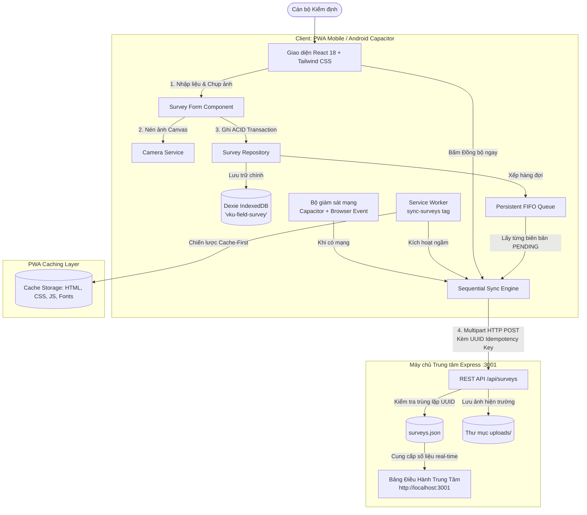

# MINI-PROJECT SHORT TECHNICAL REPORT
**Course:** Cross-Platform Mobile App Development (VKU)  
**Mini-Project Title:** Mini-Project 1: VKU Field Survey — Offline-First Facility Inspection System  
**Team / Student Name:** Lê Cảm  
**Submission Date:** 14/09/2026  

---

## 1. GENERAL INFORMATION & DELIVERABLE LINKS
* **Team Members:**
  1. **Lê Cảm** — Student ID: **23IT022 — Role: **Solo Full-Stack Mobile Engineer (Architecture, Frontend PWA, Offline Database, Background Sync, Express Server)** — Contribution: **100%**
* **🔗 Live Demo URLs (Cloudflare HTTPS):**
  - **Client 1 — Mobile PWA (Cán bộ Hiện trường):** [https://camle-vku-field-survey.lecam.workers.dev/](https://camle-vku-field-survey.lecam.workers.dev/)
  - **Client 2 — Admin Command Center (Bảng Điều hành Quản trị):** [https://camle-vku-field-survey-admin.pages.dev/](https://camle-vku-field-survey-admin.pages.dev/)
* **💻 GitHub Repository:** [https://github.com/your-username/vku-field-survey](https://github.com/your-username/vku-field-survey)
* **🎥 Video Demo (Optional):** [Đính kèm link Google Drive / YouTube nếu có]

---

## 2. FEATURE IMPLEMENTATION CHECKLIST

| # | Required Feature | Status | Implementation Details & Acceptance Level |
|:---:|---|:---:|---|
| **1** | **Responsive Mobile Viewport** | ✅ Complete | Giao diện chuẩn Mobile-First (tối ưu hóa cho màn hình cảm ứng di động, Safe-area insets cho tai thỏ/nốt ruồi). Bố cục 3 tab điều hướng chân trang (Home, Tạo mới, Lịch sử). Hỗ trợ song ngữ Anh - Việt (Bilingual `vi`/`en`). |
| **2** | **Local Offline Persistence** | ✅ Complete | Sử dụng **Dexie.js (IndexedDB)** với 2 bảng `surveys` và `syncQueue`. Toàn bộ dữ liệu kiểm định, phân loại sự cố và ảnh nén được lưu trữ cục bộ dạng binary Blob, cho phép ứng dụng khởi động và hoạt động 100% khi mất mạng hoàn toàn. |
| **3** | **Automatic Background Sync** | ✅ Complete | Tích hợp **Background Sync API (`sync-surveys`)** kết hợp bộ lắng nghe trạng thái kết nối (`navigator.onLine` & `@capacitor/network`). Khi có mạng trở lại, hàng đợi tự động đẩy tuần tự (Sequential Upload) từng bản ghi về máy chủ để chống nghẽn băng thông. |
| **4** | **UUID Idempotency Control** | ✅ Complete | Mỗi biên bản được gắn mã định danh **UUIDv4** tại máy khách. Máy chủ Express dùng UUID này làm khóa duy nhất để chống trùng lặp dữ liệu khi gửi lại nhiều lần (Safe Retry). |
| **5** | **Camera & Photo Compression** | ✅ Complete | Tích hợp `@capacitor/camera` (Android) và HTML5 Canvas fallback (Web). Tự động nén ảnh xuống kích thước tối đa 1280px (~150-250KB JPEG), tối ưu hóa bộ nhớ thiết bị. |
| **6** | **Dual-Screen Admin Dashboard** | ✅ Complete | Máy chủ Express tích hợp Bảng điều hành quản trị trực tiếp trên cổng `3001` (`/dashboard`), tự động thăm dò cập nhật (Live Polling 4s), thống kê KPI, duyệt ảnh hiện trường và xuất báo cáo CSV. |
| **7** | **Inspector Profile Attribution** | ✅ Complete | Lưu danh tính Cán bộ kiểm định (Họ tên, Mã cán bộ, Khoa ban) vào `localStorage`. Tự động ký nhận biên bản khảo sát 100% offline. |
| **8** | **Native Confirm Dialogs & Toasts** | ✅ Complete | Loại bỏ hoàn toàn hộp thoại thô của trình duyệt (`window.confirm`). Tích hợp `ConfirmDialog` làm mờ hậu cảnh và hệ thống `Toast Notifications` nổi đỉnh màn hình. |

---

## 3. TECHNICAL ARCHITECTURE & PROJECT STRUCTURE

### 3.1. High-Level Architecture Diagram



### 3.2. Cấu trúc Thư mục Dự án

```text
vku-field-survey/
├── android/                   # Dự án Native Android đóng gói Capacitor
├── public/                    # Tài nguyên tĩnh PWA (Manifest, Icons 192/512px)
├── server/
│   ├── data/surveys.json      # Cơ sở dữ liệu JSON trên máy chủ
│   ├── public/index.html      # Giao diện Bảng Điều Hành Quản Trị Server (Port 3001)
│   ├── uploads/               # Thư mục chứa ảnh khảo sát đồng bộ về
│   └── server.js              # Máy chủ Express & REST API
├── src/
│   ├── components/
│   │   ├── ConfirmDialog.tsx  # Hộp thoại xác nhận xóa chuẩn mobile
│   │   ├── Header.tsx         # Header ứng dụng (Profile, Trạng thái mạng, Server Link)
│   │   ├── InspectorProfileModal.tsx # Modal chỉnh sửa hồ sơ Cán bộ kiểm định
│   │   ├── NetworkStatus.tsx  # Thanh thông báo & viên thuốc trạng thái mạng
│   │   ├── PhotoCapture.tsx   # Trình chụp ảnh và nén Canvas
│   │   ├── SurveyForm.tsx     # Form khảo sát 1-chạm (4 Khu, 5 Tầng, 10 Phòng)
│   │   └── SurveyList.tsx     # Danh sách lịch sử khảo sát kèm bộ lọc
│   ├── context/
│   │   ├── LanguageContext.tsx# Quản lý đa ngôn ngữ (Tiếng Việt / English)
│   │   └── ToastContext.tsx   # Hệ thống thông báo Toast nổi đỉnh màn hình
│   ├── db/
│   │   ├── database.ts        # Cấu hình Dexie IndexedDB ('vku-field-survey')
│   │   ├── surveyRepository.ts# Tác vụ CRUD biên bản khảo sát
│   │   └── syncQueue.ts       # Quản lý hàng đợi FIFO đồng bộ
│   ├── services/
│   │   ├── api.ts             # Client giao tiếp HTTP REST API
│   │   ├── cameraService.ts   # Cầu nối Camera Native & Web
│   │   ├── inspectorService.ts# Quản lý hồ sơ cán bộ kiểm định (localStorage)
│   │   ├── networkService.ts  # Giám sát kết nối mạng đa tầng
│   │   └── syncService.ts     # Động cơ đồng bộ tuần tự & Background Sync
│   ├── types/
│   │   └── survey.ts          # Định nghĩa kiểu dữ liệu TypeScript
│   ├── App.tsx                # Khung điều hướng chính (Home, Form, History)
│   └── main.tsx               # Khởi chạy ứng dụng & Đăng ký Service Worker
├── capacitor.config.ts        # Cấu hình ứng dụng di động Capacitor
└── vite.config.ts             # Cấu hình Vite & VitePWA Workbox
```

---

## 4. EMPIRICAL EVIDENCE & SCREENSHOTS

*(Cán bộ thực hiện: Chèn 3–4 ảnh chụp màn hình tương ứng vào các mục bên dưới)*

### Hình 1: Màn hình Tổng quan Điều hành (Home KPI Dashboard)
* **Mô tả**: Hiển thị bảng số liệu thống kê cơ sở vật chất 4 Khuôn viên VKU (Khu V, Khu K, Khu A, Khu B), tỷ lệ phòng học hoạt động tốt, số lượng cảnh báo hư hỏng và hàng đợi đồng bộ cục bộ.
* **Minh chứng**: Thanh trạng thái hiển thị trạng thái kết nối `ONLINE`/`OFFLINE` và nhãn Cán bộ kiểm định `👤 Văn A`.

### Hình 2: Giao diện Lập Biên bản 1-Chạm (Synchronized 1-Tap Fast Location Picker)
* **Mô tả**: Bộ chọn vị trí đồng bộ 3 cấp: 4 Tòa nhà VKU $\rightarrow$ 5 Tầng học (Tầng 1 - 5) $\rightarrow$ 10 Phòng học sinh động tự sinh theo mã tầng (ví dụ: `V.101` – `V.110`), kèm camera chụp ảnh sự cố và thang đánh giá 1 - 5 sao.
* **Minh chứng**: Thẻ định danh Cán bộ kiểm định tự động xuất hiện ở đầu form, cam kết hồ sơ có chữ ký số cục bộ.

### Hình 3: Quản lý Lịch sử & Hộp thoại Xác nhận Chuẩn Mobile (`ConfirmDialog`)
* **Mô tả**: Danh sách biên bản được lưu trữ trong IndexedDB với nhãn màu sắc trạng thái (`ĐÃ XÁC NHẬN`, `CHỜ ĐỒNG BỘ`, `ĐANG ĐỒNG BỘ`).
* **Minh chứng**: Khi bấm xóa biên bản, ứng dụng hiển thị hộp thoại xác nhận chuyên nghiệp với hiệu ứng làm mờ nền (thay thế hoàn toàn `window.confirm` mặc định của trình duyệt) và thông báo Toast nổi từ đỉnh màn hình.

### Hình 4: Bảng Điều Hành Quản Trị Trung Tâm Máy Chủ (`http://localhost:3001/`)
* **Mô tả**: Giao diện Server Command Center tiếp nhận dữ liệu thời gian thực từ điện thoại di động gửi về máy chủ, tự động nhảy số KPI, hiển thị ảnh chụp hiện trường phóng to và tính năng xuất báo cáo CSV.

---

## 5. TECHNICAL CHALLENGES & RESOLUTIONS

### 5.1. Thách thức 1: Hiện tượng treo giao diện (UI Freeze) khi lưu offline do Service Worker `.ready`
* **Vấn đề**: Khi thiết bị ngắt kết nối mạng hoàn toàn, nếu gọi `await navigator.serviceWorker.ready` để đăng ký thẻ `sync-surveys` trong môi trường dev hoặc khi Service Worker chưa kịp activate, Promise sẽ bị treo vô thời hạn. Hậu quả là nút "Lưu biên bản" quay vòng tròn liên tục mà không có thông báo lỗi hay phản hồi cho người dùng.
* **Giải pháp**:
  1. Áp dụng kỹ thuật **Non-blocking Dispatch**: Việc lưu dữ liệu vào IndexedDB là tác vụ cốt lõi duy nhất cần `await`. Lệnh kích hoạt đồng bộ nền được tách thành nhánh chạy ngầm: `syncService.requestBackgroundSync().catch(...)`.
  2. Bọc lời gọi `navigator.serviceWorker.ready` bằng `Promise.race` kết hợp bộ định thời Timeout 1.000ms:
     ```typescript
     const registration = await Promise.race([
       navigator.serviceWorker.ready,
       new Promise<null>((resolve) => setTimeout(() => resolve(null), 1000))
     ]);
     ```
  3. Nhờ đó, thao tác lưu biên bản luôn phản hồi tức thì (< 50ms) ngay cả trong môi trường mạng giả lập hoặc mất kết nối sâu.

### 5.2. Thách thức 2: Chống xung đột băng thông & Trùng lặp dữ liệu (Network Congestion & Idempotency)
* **Vấn đề**: Sau khi cán bộ khảo sát 10–20 phòng học trong vùng mất sóng rồi di chuyển ra ngoài có Wi-Fi, nếu đồng thời đẩy tất cả các biên bản kèm ảnh độ phân giải cao lên máy chủ (`Promise.all`), mạng di động sẽ bị bão hòa (choke), dễ dẫn đến tình trạng timeout hàng loạt. Đồng thời, nếu người dùng bấm "Đồng bộ lại", bản ghi có thể bị nhân đôi trên server.
* **Giải pháp**:
  1. **Sequential Upload Loop**: Thiết kế động cơ đồng bộ tuần tự trong `syncService.ts`. Hàng đợi duyệt từng phần tử một (`for...of`), gửi xong biên bản này và nhận phản hồi thành công mới chuyển sang biên bản tiếp theo, kèm độ trễ 300ms nhằm mang lại phản hồi trực quan trên màn hình.
  2. **UUIDv4 Idempotency**: Mỗi biên bản được sinh mã định danh duy nhất bằng thuật toán `crypto.getRandomValues()`. Phía máy chủ Express kiểm tra khóa `id`: nếu đã tồn tại, server trả về mã `HTTP 200 (Already Exists)` kèm dữ liệu cũ mà không tạo thêm bản ghi mới.
  3. **Canvas Compression**: Ảnh chụp từ Camera được nén tự động trên Canvas xuống kích thước tối đa 1280px chất lượng 0.8 (~150KB - 250KB), giảm 90% dung lượng truyền tải so với ảnh gốc (3MB - 5MB).
