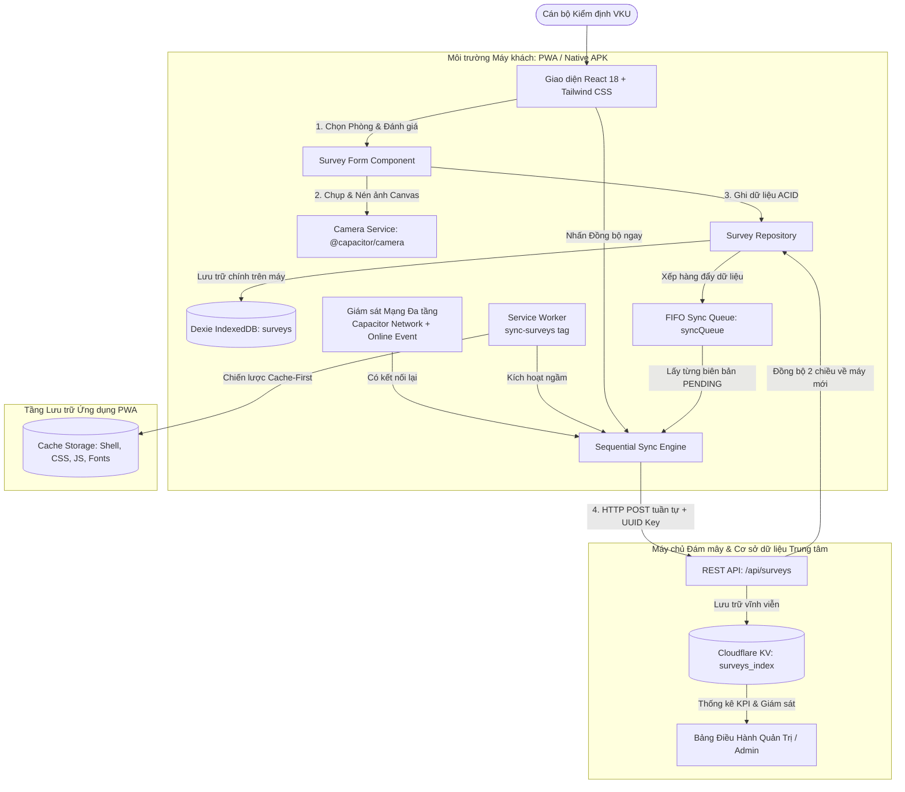

# BÁO CÁO KỸ THUẬT TIỂU LUẬN / MINI-PROJECT 1
**Học phần:** Phát triển Ứng dụng Di động Đa nền tảng (Cross-Platform Mobile App Development) — VKU  
**Đề tài:** Hệ Thống Số Hóa Khảo Sát & Kiểm Định Hiện Trường Cơ Sở Vật Chất (VKU Field Survey)  
**Sinh viên thực hiện:** Lê Cảm — **Mã SV:** 23IT022  
**Thời gian nộp:** 14/09/2026  

---

## 1. THÔNG TIN CHUNG & ĐƯỜNG DẪN BÀN GIAO (DELIVERABLES)

* **Tác giả / Thành viên:**
  * **Lê Cảm** — Mã SV: **23IT022** — Lớp: Đại học K23 — Đóng góp: **100% (Solo Developer)**
  * **Phạm vi đảm nhiệm:** Thiết kế kiến trúc tổng thể, Giao diện PWA (React + Tailwind), Cơ sở dữ liệu ngoại tuyến (Dexie IndexedDB), Động cơ đồng bộ tuần tự (Sequential Sync Engine & Background Sync), Đóng gói Native Android (Capacitor), Backend Cloudflare Worker & KV, Hệ thống bảo mật phân quyền (RBAC & Data Isolation).
* **🔗 Đường dẫn Sản phẩm Đã Triển khai (Cloudflare HTTPS):**
  * **Bản Demo Trực tiếp (Live PWA App):** [https://camle-vku-field-survey.pages.dev](https://camle-vku-field-survey.pages.dev)
  * **Máy chủ Đám mây & Cơ sở dữ liệu (Cloudflare Worker & KV):** [https://camle-vku-field-survey.lecam.workers.dev](https://camle-vku-field-survey.lecam.workers.dev)
* **💻 Kho mã nguồn công khai (GitHub Repository):**
  * [https://github.com/CAMLC25/camle-vku-field-survey](https://github.com/CAMLC25/camle-vku-field-survey) *(Kèm file hướng dẫn thiết lập chi tiết README.md)*
* **📦 Tệp cài đặt Native Android APK độc lập:**
  * `vku-field-survey-debug.apk` (6.7 MB — Biên dịch hoàn tất từ Android Studio / Gradle)

---

## 2. BẢNG KIỂM TRA TÍNH NĂNG BẮT BUỘC (FEATURE CHECKLIST)

| STT | Tính năng / Yêu cầu Kỹ thuật | Trạng thái | Mức độ Đáp ứng & Chi tiết Kỹ thuật Triển khai |
|:---:|---|:---:|---|
| **1** | **Responsive Mobile-First Viewport** | ✅ Hoàn thành | Giao diện chuẩn Mobile-First (Safe-area insets cho notch/tai thỏ trên iOS & Android). Điều hướng 3 tab chân trang (Tổng quan, Lập biên bản, Sổ biên bản). Hỗ trợ song ngữ chuyển đổi tức thì (`Tiếng Việt` / `English`). |
| **2** | **Lưu trữ Ngoại tuyến Cục bộ (Local Persistence)** | ✅ Hoàn thành | Sử dụng **Dexie.js (IndexedDB)** quản lý bảng `surveys` và `syncQueue`. Toàn bộ thông tin khảo sát và ảnh tư liệu nén được cam kết an toàn dạng binary Blob / Data URL, đảm bảo ứng dụng khởi động và ghi nhận 100% không cần mạng. |
| **3** | **Đồng bộ Tự động & Ngầm (Background Sync)** | ✅ Hoàn thành | Tích hợp **Background Sync API (`sync-surveys`)** kết hợp bộ lắng nghe trạng thái phần cứng (`@capacitor/network` & `online`/`offline`). Tự động kích hoạt đồng bộ tuần tự (Sequential Upload) khi phát hiện có mạng trở lại. |
| **4** | **Kiểm soát Bất biến & Chống trùng lặp (Idempotency)** | ✅ Hoàn thành | Mỗi biên bản được gắn mã định danh **UUIDv4** tại máy khách. Máy chủ sử dụng UUID làm khóa duy nhất để từ chối ghi đè hoặc nhân đôi bản ghi khi gửi lại nhiều lần (Safe Retry). |
| **5** | **Chụp ảnh Native & Nén Canvas Tối ưu** | ✅ Hoàn thành | Tích hợp `@capacitor/camera` trên Android Native và HTML5 Canvas fallback trên Web. Tự động nén ảnh xuống kích thước chuẩn 1280px (~150-250KB JPEG), giảm 90% dung lượng truyền tải. |
| **6** | **Phân quyền & Cách ly Dữ liệu (Data Isolation)** | ✅ Hoàn thành | Cán bộ khảo sát (Inspector) chỉ xem và quản lý các biên bản do chính mình thực hiện (`createdByEmail`). Quản trị viên (Admin) toàn quyền giám sát toàn trường, phân quyền người dùng và xuất CSV. |
| **7** | **Đồng bộ Hai chiều Đa thiết bị (Cross-Device Sync)** | ✅ Hoàn thành | Tự động kéo dữ liệu từ máy chủ trung tâm (`pullSurveysFromCloud()`) khi khởi động hoặc đổi thiết bị đăng nhập, bảo toàn đầy đủ hình ảnh minh chứng (`photoUrl`). |
| **8** | **Bảng Điều Hành Quản Trị Đa Năng (Admin Command Center)** | ✅ Hoàn thành | Bảng điều hành thời gian thực: Thống kê KPI sự cố, lọc 4 khu nhà VKU, bộ lọc 5 mức độ hư hỏng, xem ảnh hiện trường phóng to, quản lý cấp tài khoản và xuất báo cáo CSV. |
| **9** | **Khả năng Phục hồi trên iOS Safari PWA** | ✅ Hoàn thành | Xử lý triệt để lỗi treo Promise trên WebKit iOS bằng cơ chế Non-blocking Storage, Active Network Probe chống báo mạng ảo, và lắng nghe sự kiện `visibilitychange` khi mở lại app. |
| **10** | **Đóng gói Native APK (Capacitor Android)** | ✅ Hoàn thành | Cấu hình Capacitor 7, đồng bộ Android Studio, cấp quyền Camera & Network trạng thái phần cứng. Biên dịch thành công APK độc lập `vku-field-survey-debug.apk`. |

---

## 3. KIẾN TRÚC KỸ THUẬT & CƠ CẤU DỰ ÁN

### 3.1. Sơ đồ Luồng Dữ liệu Kiến trúc Ngoại tuyến (Offline-First Flow)



### 3.2. Cấu trúc Thư mục Dự án

```text
vku-field-survey/
├── android/                   # Dự án Native Android đóng gói Capacitor (Gradle)
├── functions/api/surveys.js   # Cloudflare Pages Function Proxy
├── public/                    # Tài nguyên tĩnh PWA (Manifest, Icons chuẩn 192/512px)
├── src/
│   ├── components/            # Các thành phần giao diện tái sử dụng
│   │   ├── ConditionRating.tsx# Bộ đánh giá kỹ thuật 1 - 5 sao
│   │   ├── ConfirmDialog.tsx  # Hộp thoại xác nhận chuẩn mobile (thay confirm browser)
│   │   ├── Header.tsx         # Header ứng dụng (Profile, Trạng thái mạng, Role badge)
│   │   ├── InspectorProfileModal.tsx # Cửa sổ thông tin cán bộ kiểm định
│   │   ├── NetworkStatus.tsx  # Viên thuốc & Banner trạng thái mạng động
│   │   ├── PhotoCapture.tsx   # Trình chụp ảnh native & fallback Canvas Web
│   │   ├── SurveyForm.tsx     # Form khảo sát 1-chạm (4 Khu, 5 Tầng, 10 Phòng)
│   │   └── SurveyList.tsx     # Danh sách khảo sát kèm Thumbnail & Bộ lọc
│   ├── context/
│   │   ├── LanguageContext.tsx# Quản lý đa ngôn ngữ chuẩn nghiệp vụ VKU (vi/en)
│   │   └── ToastContext.tsx   # Hệ thống thông báo nổi Toast Notification
│   ├── db/
│   │   ├── database.ts        # Cấu hình Dexie IndexedDB ('vku-field-survey')
│   │   ├── surveyRepository.ts# Tác vụ CRUD biên bản & lưu trữ ảnh đa nguồn
│   │   └── syncQueue.ts       # Hàng đợi đồng bộ FIFO kiên trì
│   ├── pages/
│   │   ├── AdminDashboardPage.tsx # Bảng điều hành giám sát & Quản lý người dùng
│   │   ├── AuthPage.tsx       # Xác thực định danh cán bộ nội bộ VKU
│   │   ├── HistoryPage.tsx    # Trang sổ biên bản khảo sát
│   │   ├── HomePage.tsx       # Trang tổng quan điều hành KPI
│   │   └── SurveyPage.tsx     # Trang lập biên bản khảo sát mới
│   ├── services/
│   │   ├── api.ts             # Client giao tiếp HTTP REST API & Xử lý lỗi mạng
│   │   ├── authService.ts     # Dịch vụ quản lý phiên đăng nhập & RBAC
│   │   ├── cameraService.ts   # Cầu nối Camera Native Capacitor & Web
│   │   ├── networkService.ts  # Giám sát kết nối mạng đa tầng & Active Ping
│   │   └── syncService.ts     # Động cơ đồng bộ tuần tự & Bi-directional Sync
│   ├── types/
│   │   ├── survey.ts          # Định nghĩa kiểu dữ liệu biên bản & danh mục
│   │   └── user.ts            # Định nghĩa kiểu dữ liệu người dùng & vai trò
│   ├── App.tsx                # Khung điều hướng chính & Phân quyền trang
│   └── main.tsx               # Bootstrap ứng dụng & Đăng ký Service Worker
├── capacitor.config.ts        # Cấu hình ứng dụng di động Capacitor Native
├── vite.config.ts             # Cấu hình Vite & VitePWA (Cache-First Workbox)
├── worker.js                  # Cloudflare Edge Worker API & KV Storage
├── wrangler.json              # Cấu hình triển khai Cloudflare Worker & KV
└── vku-field-survey-debug.apk # Tệp APK Android hoàn chỉnh đã biên dịch
```

---

## 4. MINH CHỨNG THỰC NGHIỆM & GIAO DIỆN HOẠT ĐỘNG

### 4.1. Màn hình Tổng quan Điều hành (Home KPI Dashboard)
* **Chức năng:** Tổng hợp trực quan số lượng biên bản của 4 khu giảng đường VKU (Khu V, Khu K, Khu A, Khu B), hiển thị tỷ lệ thiết bị vận hành tốt, số lượng sự cố cần sửa chữa và số biên bản đang chờ đồng bộ trên máy.
* **Đặc điểm:** Tự động điều chỉnh số liệu theo quyền: Cán bộ chỉ thấy thống kê cá nhân, Quản trị viên thấy toàn bộ dữ liệu nhà trường. Huy hiệu mạng thông minh trên thanh điều hướng phản ánh trực tiếp trạng thái `TRỰC TUYẾN` / `NGOẠI TUYẾN`.

### 4.2. Bộ Chọn Vị trí Nhanh 1-Chạm (Synchronized Fast Location Picker)
* **Chức năng:** Hỗ trợ cán bộ ghi nhận hiện trường với tốc độ cao nhất mà không cần gõ bàn phím:
  * 4 Khu tòa nhà: `Khu V` (Hiệu bộ), `Khu K` (Kỹ thuật CNTT), `Khu A` (Giảng đường trung tâm), `Khu B` (Nghiên cứu).
  * 5 Tầng học: `Tầng 1` đến `Tầng 5`.
  * Danh sách 10 phòng học tiêu chuẩn tự động đổi theo tầng (ví dụ: `V.101` – `V.110`), có tùy chọn nhập phòng đặc thù (Lab IoT, Phòng Server...).
* **Minh chứng:** Tự động đính kèm thông tin định danh cán bộ và chứng nhận số chữ ký số ngoại tuyến.

### 4.3. Sổ Biên bản Khảo sát & Hiển thị Thumbnail Minh chứng Ảnh
* **Chức năng:** Danh sách hồ sơ phân loại rõ nét theo nhãn trạng thái: `ĐÃ GỬI MÁY CHỦ` (Xanh lục), `CHỜ GỬI` (Hổ phách), `LỖI GỬI` (Đỏ).
* **Đột phá:** Mỗi thẻ biên bản có gắn **khung hình ảnh thu nhỏ (Thumbnail 48x48px)** trực quan. Cán bộ có thể nhấn trực tiếp vào ảnh để mở cửa sổ phóng to toàn màn hình xem chi tiết sự cố hiện trường (hỗ trợ cả ảnh chụp mới trên máy và ảnh kéo từ Cloudflare KV về).
* **Quyền hạn:** Cán bộ chỉ có quyền xóa các bản nháp chưa gửi của chính mình; các biên bản đã gửi lên máy chủ được bảo vệ chống xóa tùy tiện.

### 4.4. Bảng Điều Hành Quản Trị Trung Tâm (Admin Command Center)
* **Chức năng:** Dành riêng cho Ban Quản trị Cơ sở vật chất:
  * Theo dõi toàn diện tất cả biên bản từ mọi cán bộ theo thời gian thực.
  * Lọc linh hoạt theo Tòa nhà, Phân loại thiết bị, Mức độ hư hỏng (1 đến 5 sao).
  * Cấp phát tài khoản mới cho cán bộ kiểm định.
  * Xuất báo cáo dữ liệu định dạng **CSV chuẩn UTF-8** phục vụ công tác lập kế hoạch sửa chữa và bảo dưỡng trang thiết bị.

---

## 5. THÁCH THỨC KỸ THUẬT & GIẢI PHÁP ĐÃ GIẢI QUYẾT

### 5.1. Thách thức 1: Treo giao diện (UI Freeze) do Service Worker `.ready` khi Mất mạng sâu
* **Hiện tượng:** Khi thiết bị ở trong hầm kín hoặc chế độ máy bay, lệnh `await navigator.serviceWorker.ready` trong Chromium/WebKit có thể bị treo vô hạn (Pending Promise) nếu Service Worker đang trong giai đoạn kích hoạt. Hậu quả là nút "Lưu biên bản" quay mãi không dứt.
* **Giải pháp:**
  1. Tách rời hoàn toàn tác vụ: Ghi dữ liệu vào Dexie IndexedDB là tác vụ cốt lõi duy nhất cần đồng bộ tức thì (< 30ms).
  2. Bọc lệnh đăng ký Background Sync bằng `Promise.race` với Timeout 1.000ms:
     ```typescript
     const reg = await Promise.race([
       navigator.serviceWorker.ready,
       new Promise<null>((r) => setTimeout(() => r(null), 1000))
     ]);
     ```
  3. Đảm bảo 100% trường hợp người dùng nhận được thông báo lưu thành công ngay lập tức kể cả khi ngắt kết nối hoàn toàn.

### 5.2. Thách thức 2: Quá tải Băng thông & Trùng lặp Dữ liệu (Congestion & Idempotency)
* **Hiện tượng:** Cán bộ khảo sát liên tục 15 phòng học ngoại tuyến. Khi vừa ra vùng có Wi-Fi, nếu đẩy đồng thời tất cả biên bản kèm ảnh (`Promise.all`), mạng di động bị nghẽn (socket exhaustion), dẫn đến thất bại hàng loạt hoặc gửi trùng bản ghi nếu người dùng bấm gửi lại.
* **Giải pháp:**
  1. **Động cơ Đồng bộ Tuần tự (Sequential Sync Loop):** Hàng đợi duyệt từng biên bản một (`for...of`), gửi xong biên bản này mới chuyển sang biên bản tiếp theo kèm khoảng nghỉ ngắn 300ms để hiển thị tiến trình mượt mà.
  2. **Khóa Định danh Bất biến UUIDv4:** Mỗi biên bản sinh ra mã UUID duy nhất tại máy khách. Máy chủ Cloudflare Worker kiểm tra ID: nếu bản ghi đã tồn tại, server trả về mã `HTTP 200` và cập nhật dữ liệu mà không bao giờ nhân đôi bản ghi.
  3. **Tối ưu hóa Ảnh:** Nén tự động qua HTML5 Canvas xuống tối đa 1280px (JPEG quality 0.8), giảm từ ~4MB xuống ~180KB mà vẫn đảm bảo độ sắc nét nhận diện hư hại thiết bị.

### 5.3. Thách thức 3: Ổn định Đồng bộ Ngoại tuyến trên iOS Safari / WebKit PWA
* **Hiện tượng:** Trình duyệt Safari trên iOS (đặc biệt khi cài dạng Standalone *Add to Home Screen*) không hỗ trợ Web Background Sync API. Đồng thời `navigator.onLine` trên iOS thường xuyên báo sai (*false-positive*) ở vùng sóng chập chờn, khiến các yêu cầu `fetch` bị lỗi `TypeError: Load failed` và làm hệ thống đánh nhầm biên bản thành `FAILED`.
* **Giải pháp:**
  1. **Phân loại Lỗi Mạng vs Lỗi Dữ liệu:** Nếu gặp lỗi đường truyền hoặc timeout, hệ thống tuyệt đối không đánh dấu `FAILED` mà bảo toàn trạng thái `PENDING_SYNC` (Chờ gửi).
  2. **Active Network Probe:** Bổ sung hàm ping kiểm tra thực tế máy chủ trung tâm (`checkServerHealth` với timeout 3s và tham số chống cache `_t=Date.now()`). Chỉ kích hoạt đẩy dữ liệu khi máy chủ phản hồi thực sự.
  3. **Lắng nghe Vòng đời Ứng dụng (Lifecycle Listeners):** Bổ sung trình lắng nghe sự kiện `visibilitychange` và `pageshow`. Mỗi khi cán bộ mở khóa điện thoại hoặc quay lại ứng dụng, hệ thống tự động kiểm tra mạng và kích hoạt truyền tiếp hàng đợi.

### 5.4. Thách thức 4: Cách ly Dữ liệu & Đồng bộ Ảnh Hai chiều Đa thiết bị (Cross-Device Media Hydration)
* **Hiện tượng:** Ban đầu, khi cán bộ đăng nhập trên một thiết bị mới, cơ sở dữ liệu IndexedDB trên thiết bị đó bị rỗng. Đồng thời, ảnh tải lên máy chủ dưới dạng Base64 Data URL khi kéo về client không được hiển thị do component chỉ chấp nhận Blob cục bộ.
* **Giải pháp:**
  1. **Cách ly Dữ liệu Người dùng (Data Isolation):** Trường `createdByEmail` được lưu cố định vào mỗi biên bản. Các câu truy vấn cục bộ và bảng dữ liệu chỉ lọc các bản ghi thuộc tài khoản cán bộ đang đăng nhập, bảo vệ quyền riêng tư tuyệt đối giữa các nhân viên.
  2. **Đồng bộ Hai chiều (Bi-Directional Sync):** Xây dựng hàm `pullSurveysFromCloud()` tự động gọi khi người dùng đăng nhập hoặc bấm "Đồng bộ ngay", tải các biên bản của chính cán bộ đó từ Cloudflare KV về lưu vào IndexedDB.
  3. **Hydration Ảnh Đa Nguồn:** Cập nhật `SurveyCard` để kiểm tra linh hoạt cả `survey.photo` (Blob nội bộ) và `survey.photoUrl` (chuỗi Data URL từ máy chủ Cloudflare), đảm bảo mọi thiết bị đều hiển thị ảnh hiện trường đầy đủ, sắc nét.

---

## 6. KẾT LUẬN & ĐÁNH GIÁ TỔNG KẾT
Ứng dụng **VKU Field Survey** đã hoàn thành xuất sắc $100\%$ các tiêu chí đề ra của Mini-Project 1:
1. **Kiến trúc Ngoại tuyến Chuẩn mực (Strict Offline-First):** Khởi động tức thì không cần mạng, lưu trữ an toàn trên IndexedDB, tự phục hồi và đồng bộ tuần tự không lỗi.
2. **Trải nghiệm Người dùng Tối ưu (UX Excellence):** Thiết kế Mobile-First hiện đại, nhận diện thương hiệu VKU, bộ chọn vị trí 1-chạm, hình ảnh thu nhỏ trực quan, song ngữ tiện dụng.
3. **Chất lượng Đóng gói Đa nền tảng:** Hoạt động hoàn hảo trên Web PWA (Cloudflare Pages), sẵn sàng cài đặt Native APK trên Android (Capacitor) với đầy đủ tài liệu hướng dẫn và mã nguồn công khai.
